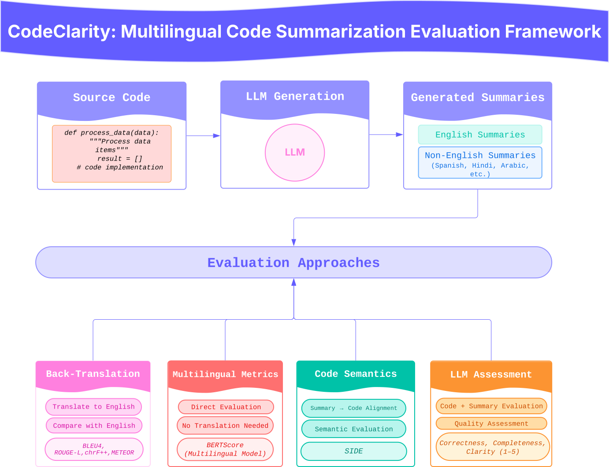

# MuCoSF: Multilingual code summarization framework for evaluating LLMs
MuCoSF is a multilingual evaluation framework designed to assess the capabilities of LLMs in generating code summaries across diverse natural languages. While most code summarization tools and benchmarks are English-centric, this project explores how well current LLMs serve the broader global developer community.

This repo contains official code for the paper [Insert ArXiv Link Here]



# Benchmark Dataset

| **Dimension**           | **Options**                                                                 |
|-------------------------|------------------------------------------------------------------------------|
| Programming Languages   | Python, Java, JavaScript, PHP, Go, Ruby                                      |
| Natural Languages       | Spanish (ES), French (FR), Hindi (HI), Arabic (AR), Mandarin Chinese (ZH), Portuguese (PT) |
| Function Length Buckets | Short (≤10 lines), Medium ( lines), Long ( lines)                    |


#  Set Up
To run the evaluation suite:

1. Clone this repository:
   ```bash
   git clone https://github.com/MadhuNimmo/CodeClarity.git
   cd CodeClarity
   pip install -r requirements.txt
   ```
2. Evaluate Predictions
   ```bash
   python metrics/eval.py --input predictions/ 
   ```
3. Run LLM-judge evaluations (API required)
   ```bash
   python judge_eval/run_llm_judge.py --mode comparison
   ```

# 📄 Citation
If you find our code and paper useful, please consider citing our works.
```
@article{ahmed2024tdd,
  title={MuCoSF: Multilingual code summarization framework for evaluating LLMs}, 
  author={Madhurima, Drishti, Eman, Maryam, },
  journal={arXiv preprint arXiv:},
  year={2024} 
}
```
   
This research was conducted by Madhurima, Drishti, Eman, Maryam,  
