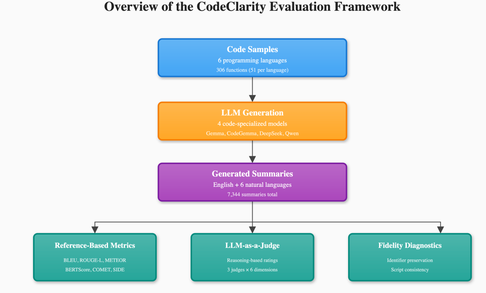
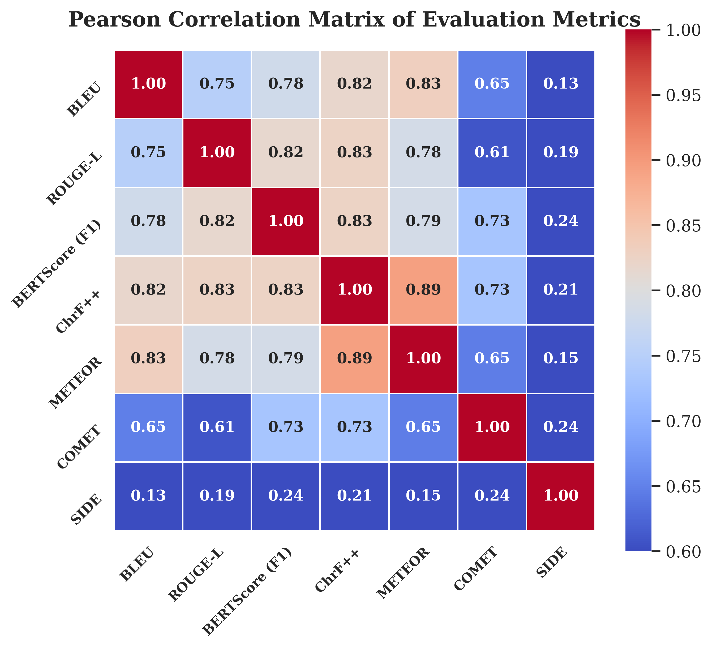
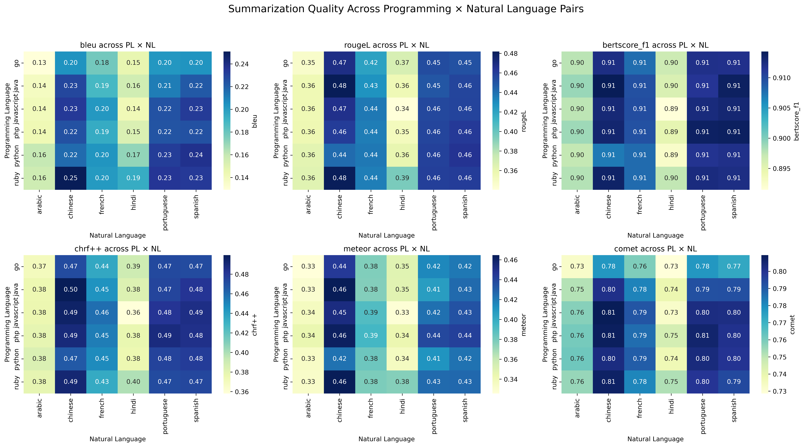
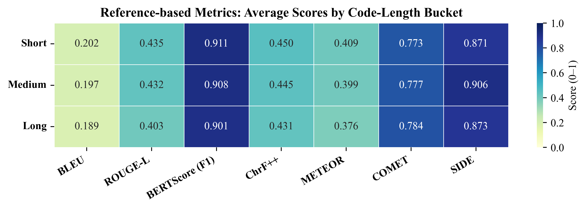
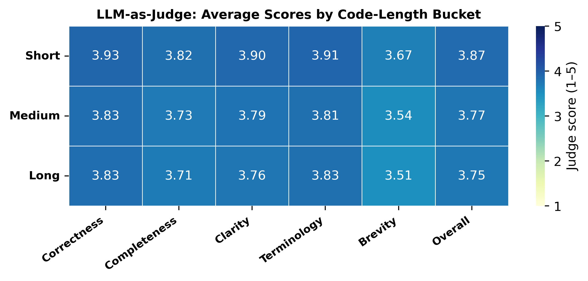

<div align="center">
  <h1>CodeClarity: A Framework and Benchmark for Evaluating Multilingual Code Summarization</h1>
  <p>
    <a href="https://arxiv.org/abs/">
      
    </a>
    <a href="https://www.python.org/downloads/release/python-380/">
      
    </a>
    <a href="https://huggingface.co/datasets">
      
    </a>
  </p>
</div>

# Overview

CodeClarity is a multilingual benchmark and evaluation suite designed to assess the performance of Large Language Models (LLMs) in code summarization across diverse programming and natural languages. While most existing benchmarks focus on English-only summaries, CodeClarity provides a unified and language-diverse evaluation setup to better understand LLM generalization for global developer communities.

This work introduces the first reproducible foundation for studying multilingual code summarization. We released CodeClarity-Bench and its accompanying pipeline, enabling large-scale community validation and future research on multilingual code understanding.

CodeClarity introduces:

- CodeClarity-Bench, a dataset of ~7,344 multilingual summaries covering 6 programming languages and 6 natural languages.
- Evaluation in **6 natural languages**.
- Comprehensive evaluation metrics (BERTScore, ROUGE, METEOR, BLEU, ChrF, COMET, SIDE).
- Human-in-the-loop LLM-judge scoring mechanisms for qualitative assessment.
<p align="center">
  
</p>

## Benchmark Composition

| **Dimension**           | **Details**                                                                                |
| ----------------------- | ------------------------------------------------------------------------------------------ |
| Programming Languages   | Python, Java, JavaScript, PHP, Go, Ruby                                                    |
| Natural Languages       | Spanish (ES), French (FR), Hindi (HI), Arabic (AR), Mandarin Chinese (ZH), Portuguese (PT) |
| Function Length Buckets | Short (≤10 lines), Medium (11–30 lines), Long (>30 lines)                                  |

---

### Table of Contents

- [Project Structure](#project-structure)
- [Environment Setup](#environment-setup)
- [Data Generation](#data-generation)
- [Data Preparation](#data-preparation)
- [Running Evaluations](#running-evaluations)
- [Analysis and Visualization](#analysis-and-visualization)
- [Adding New Models or Metrics](#adding-new-models-or-metrics)

---

## Project Structure

- `notebooks/`  
  Jupyter notebooks for analysis and visualization.
- `data/`  
  Contains all evaluation data and results.
- `scripts/`  
  Python scripts for running evaluations, preprocessing, or metric computation.
- `src/`
  Core modules for data handling, model interfacing, and metric calculations.

## Environment Setup

1. **Install dependencies**  
   (Run in a clean environment for reproducibility.)
   ```bash
   poetry install
   ```

## Data Generation

### Step1:

To reproduce the dataset exactly, users need to know:

- Programming Languages:\
  Python, Java, JavaScript, PHP, Go, Ruby

- Natural Languages:\
  Spanish (ES), French (FR), Hindi (HI), Arabic (AR), Mandarin Chinese (ZH), Portuguese (PT)

- Function Length Buckets:\
  Short (≤10 lines), Medium (11–30 lines), Long (>30 lines)

- Number of samples per bucket:\
  e.g., 3

- Split:\
  train, valid, or test

### Step 2:

For evaluation, you only need to set --save_dir or --output_csv if they you to override defaults.

```bash
   python scripts/run_generation.py
    --config config/generation.json \
    --model gemma \
    --split test \
    --out_dir data/code_summaries/generated \
    --samples_per_bucket 3 \
    --languages "Spanish" "French" "Hindi" "Arabic" "Mandarin Chinese" "Portuguese" \
    --source codesearchnet
```

#### Notes:

The script automatically uses the `programming_languages` and `function_length_buckets` defined in the config.
If you want to adjust number of samples per bucket, change `--samples_per_bucket.`
For train or valid splits, replace `--split test` with `--split train` or `--split valid.`

### Step3:

- Optional overrides

* To use any custom configuration feel free to change the `--config` argument to point to your custom config file.
* To use a different model or any other settings:

```bash
--model codegemma
```

## Data Preparation

- Place your generated summaries in the `data/code_summaries/` directory following the naming convention: `<model_name>`.
- Each file should contain JSON lines with the following structure:
  ```json
  {
    "id": "unique_sample_identifier",
    "language": "programming_language_here",
    "code": "function_code_here",
    "docstring": "docstring_here",
    "reference_summary": "reference_summary_here",
    "generated_summary": "model_generated_specific_lang_summary_here",
     "..."
     }
  ```
- Backtranslate reference summaries using the provided script and saved in the `data/backtranslated_summaries/` directory:
  ```bash
  python scripts/backtranslate_references.py
  ```

## Running Evaluations

### 1. Automated Metrics Evaluation

To evaluate model-generated summaries against reference summaries, run:

```bash
   scripts/run_evaluation.py \
        --config config/my_custom_eval.json \
        --save_dir results/test_run \
        --output_csv results/test_run/final_eval.csv
```

- Make sure your JSON folder in the config `(config/evaluation.json)` contains all the JSON summaries you want to evaluate.
- Run the command above it will load the SIDE and COMET models automatically.
- After completion, the combined CSV will appear at the path you specified `(--output_csv)`.
- If you only want to specify a folder and not the exact CSV, you can omit `--output_csv`:

### 2. LLM-Judge Evaluation

To perform qualitative assessment using LLMs as judges (e.g., Gemini, Cohere), we provide dedicated scripts in `scripts/llm_evaluation/`. This allows for scoring summaries on dimensions like correctness, completeness, clarity, terminology, and brevity.

1.  **Set your API Key** (e.g., for Gemini):

    ```bash
    export GEMINI_API_KEY="your_api_key_here"
    ```

2.  **Run the Evaluation Script**:
    ```bash
    python scripts/llm_evaluation/evaluate_multilingual_summaries_gemini.py \
      data/code_summaries/generated/your_model_outputs.json \
      --out-scores results/llm_judge/scores.json \
      --out-aggregates results/llm_judge/aggregates.json
    ```

## Analysis and Visualization

We provide several visualization tools and notebooks to analyze the benchmark results.

### Metric Correlations & Heatmaps

|                                 **Pearson Correlation**                                  |                        **Performance Heatmap (PL vs NL)**                         |
| :--------------------------------------------------------------------------------------: | :-------------------------------------------------------------------------------: |
|  |  |

### Impact of Code Length

|                         **Reference-based Metrics by Bucket**                         |                             **LLM-Judge Scores by Bucket**                             |
| :-----------------------------------------------------------------------------------: | :------------------------------------------------------------------------------------: |
|  |  |

Check the `notebooks/` directory for detailed analysis scripts:

- `notebooks/analysis_main.ipynb`: General performance analysis.
- `notebooks/plotting.ipynb`: Generating the figures shown above.

## Adding New Models or Metrics

### Adding a New Model

1.  Update `scripts/run_generation.py` to include your model's loading and generation logic.
2.  Add the model name to `config/generation.json`.

### Adding a New Metric

1.  Implement the metric calculation in `src/metrics/`.
2.  Register the metric in `scripts/run_evaluation.py`.

## Citation

If you find this framework or dataset useful, please consider citing our work:

```bibtex
@misc{madhurima2025codeclarity,
  title={CodeClarity: A Framework and Benchmark for Evaluating Multilingual Code Summarization},
  author={Madhurima Chakraborty, Drishti Sharma, Maryam Sikander and Eman Nisar},
  journal={arXiv preprint arXiv:XXXX.XXXXX},
  year={2025}
}
```

---

## Contact

For questions or suggestions, please open an issue or contact the authors at [email].
